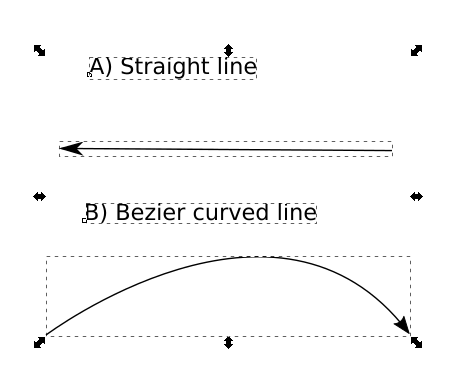
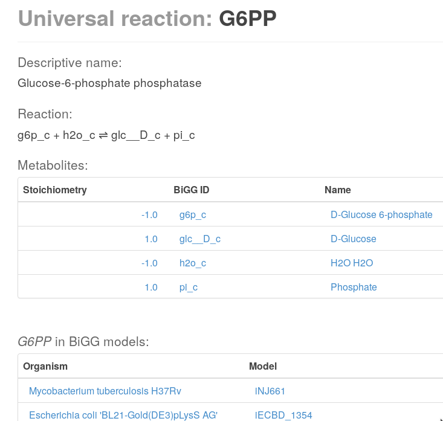

VizAn is Python based visualization tool.
=========================================

VizAn is Python based visualization tool for Flux Balance Analysis (FBA) and
Flux variability analysis (FVA) tool. VizAn uses SVG file based network drawings
to visualize optimization results.  In constraint based modelling analysis
results visualisation is made using 2 different approaches :

1. manual made biochemical network layout.
2. automatically made biochemical network layout.

As one of main negative aspects of automatically made biochemical network layout
is that once changes are made in network and all network layout is differently
generated. This complicates network drawing analysis and representation of optimisation results.
VizAn is visualisation tool which operate with manual developed biochemical
network layouts made in vector graphic tool Inkscape (atsauce), uses python
environment to visualize biochemical network optimisation results and generate
new interactive SVG file, which can be launched using WEB browsers like
Chrome, Mozilla Firefox, Safari, Microsoft Edge running on Windows, Linux
and Mac OS operations systems.
This enables easy optimization results distribution between users on most computer operation systems.

**VizAn functionality necessary tools:**
----------------------------------------

To generate new SVG biochemical network layout there is need to installed several tools and programs:

1. install and run (Inkscape installation information) vector graphic tool Inkscape;
2. Additional python package pySVG (???) needs to bee installed;
3. WEB browser like Chrome, Mozilla Firefox or Safari to view generated drawings
4. Python (???).
5. Constraint Based modelling tool (CobraPy or ScrumPy) needs to be installed to generate optimization results.

**a) draw network**

To generate biochemical network layout only Inkscape vector graphic tool is required.
Reactions are represented by Bezier curves (1B) and straight  lines (1A) in Inkscape :

    Fig 1 reaction representation in Inkscape A) Straight line B) Bezier curved line.

To add direction arrows needs to run **Fill and Stroke** properties **Stroke Style** window and choose under
the **markers** directionality arrow (Fig 2):

    Fig. 2.1 Directionality arrow option window

    Fig. 2.2 Example of arrows for straight and Bezier curved lines.

into biochemical network layout user adds Label element near the reaction line element, as  numerical representation
field to visualize FBA and FVA optimisation data (Fig 3).
This label must in the form "REACTION_LABEL SOME_FLUX_VALUE", for example "PGI 0.00".
If REACTION_LABEL is not from BiGG database, then the informational tooltip will not work.

    Fig. 3 Label element addition for FBA or FVA result representation.

All elements should be grouped under one **group** element and **id field** of group element should be the reaction id
from constraint based metabolic **model**.

**Note:**
script works only when all elements of layout are ungrouped. Some times there is need to ungroup all objects several time.
This should be considered when only some elements are modified with VizAn tool ).

To group elements go to object menu and chose the group command. To change Group element id go to Object and choose
Object Properties option and under id field write reaction id value (Fig 4).

.. figure:: img/figure4.png
    :scale: 50%
    :alt: Fig. 4.

    Fig. 4. Adding reaction id value for grouped element as reaction element in VizAn.

To change line element width go to main menu **Object**, **Fill and Stroke** option and choose **Stroke style** option
called **Width**.

All previous steps should be repeated to create new reaction element in VizAn. This is basic necessary information for
reactions in VizAn.

**b) create metabolites**

In FBA and FVA results visualisation there is need to create / use metabolites
and reactions to represent optimisation results. To create metabolite in
Inkscape **text** element is used. Choose label text element from left side |text_symbol|,
put cursor on page layout and chose place where metabolite will be located.
Write in **text element**  metabolite **ID** or if it is too long then **short abbreviation**.
Metabolite size is changed in **text element modification process** where changing
**font size** metabolite name is changed. When visualisation layout is in creation
stage and model itself in ScrumPy or CobraPy do not contain necessary data for
tooltip window visualisation, then this information needs to bee filled as
metabolite (text) element class.

For CobraPy FBA solution visualization there is need to insert information
like (example is found in BIGG database :
http://bigg.ucsd.edu/models/iJO1366/metabolites/10fthf_c ):

a. Metabolite charge information as class : ‘Charge’
b. Metabolites compartmentalization place as class : “Compartment”
c. Metabolites chemical formula  as class “Formula”
d. Metabolite full name as class : “Name”
e. metabolite ID should be written in text element which represents it (FIG ??? where NADH metabolite is represented
as BIGG database id NADH and NAD as id name NAD).

    Fig ??? Metabolite id name representation  where VizAn is used for information visualization.

    Fig ??? CobraPy mandatory metabolite information what will be used to show in tooltip information.

To create new metabolite for ScrumPy tool there is need to add mandatory fields:

a. id_metabolite

All other information will be displayed in WEB browser by MetaCyc clicking the link in tooltip

.. figure:: img/figure6.1.png
    :scale: 50%
    :alt: Fig.

    **ZIIMEEJUMS VAJAG**

**c) create new reaction**

Reactions are representing enzyme conversion of metabolites. This is done using straight
or Bezier line elements in InkScape. How to draw reactions is described in section ???.
To get more precise information from visualization tool the tooltip is used.
ScrumPy or CobraPy do not contain necessary data for tooltip window visualisation,
then this information needs to bee filled as reaction (shape) element class.

**d) grouping policy**
Grouping policy in VizAn is described in Fig. 4, where is described necessary elements to create VizAn standard
reaction element. All reaction shapes, directionality elements and text element which will represent optimization
results should be grouped in 1 common group element. Only this group element should be granted by additional reaction
information as class attributes (FIG 4.).
Mandatory information to visualize  ScrumPy optimisation results are the same (Fig ???):

a. Reaction full name as shape element class : “Name”
b. Reaction stoichiometry (which metabolites and in what direction are produced) as shape element class : “Stoichiometry”
c. Reaction unique identifier ID, which will be used to create link to Metacyc database and gather more precise
information about reaction (FIG ???)

    Fig ??? ScrumPy mandatory information for VizAn reaction element in Inkscape environment.

    Fig ???_reaction example of Glucose-6-phosphate phosphatase reaction detailed information in BIGG database.

Mandatory information to visualize  CobraPy optimisation results are the same:

a) Reaction full name as shape element class : “Name”
b) Reaction stoichiometry (which metabolites and in what direction are produced) as shape element class : “Stoichiometry”
c) Reaction unique identifier ID, which will be used to create link to BIGG database and gather more precise information
about reaction (FIG ???)

    Fig ???_reaction example of Glucose-6-phosphate phosphatase reaction detailed information in MetaCyc database.

**e) adding additional reaction information**

VizAn tooltip is not developed yet to show in user friendly tooltip the additional reaction information, but this not
mean that this information can not be added into SVG visualization file for future use. CobraPy environment reaction
can offer to use additional information like:

a. GPR – gene protein reaction information;
b. Lower Bound – lowest possible flux rate amount in the model;
c. Upper Bound – highest possible flux rate amount in the model;
d. Compartments – in which compartment metabolite is located;
e. Reduced_cost - The reduced cost indicates how much the objective value where to increase, if you were to increase
the flux through the associated reaction (her: 2984) by one unit;
f. Pathway – (Subsystem) in which pathways reaction is involved.

In future there is possibility to evolve VizAn to show and analysis this additional reaction information, but now this
info can be gathered for each reaction clicking link button and opening BIGG database reaction information in browser
(Fig ???_reaction example).
CobraPy environment metabolite can offer to use additional information like:

a. 'Elements' -  get chemical formula in dictionary format where each chemical element and number of it is stored in
variable
b.  Shadow_price - A shadow price is the sensitivity of the objective function with respect to the change in a constraint.

ScrumPy environment reaction can offer to use additional information like:

a. GPR – gene protein reaction information;
b. Compartments – in which compartment metabolite is located;
c. Pathway – (Subsystem) in which pathways reaction is involved;

All information can be gathered using Metacyc downloaded organism specific databases as .FLAT
(http://bioinformatics.ai.sri.com/ptools/flatfile-format.html ) files. ScrumPy has
functionality (http://mudshark.brookes.ac.uk/ScrumPy/Doc ) to integrate FLAT files and
gather reaction specific information.

ScrumPy environment metabolite can offer to use additional information like :

a. 'Elements' -  get chemical formula in dictionary format where each chemical element and number of it is stored in
variable
b. SMILES - Simplified Molecular Input Line Entry System code, which interprets metabolite 3d chemical formulae:
c. InChI -  International chemical identifier,  which is used to encode molecular information.
d. KEGG – KEGG database ID .

All information can be gathered using Metacyc downloaded organism specific databases as .FLAT
(http://bioinformatics.ai.sri.com/ptools/flatfile-format.html ) files. ScrumPy has
functionality (http://mudshark.brookes.ac.uk/ScrumPy/Doc ) to integrate FLAT files and
gather  metabolite specific information.

**g) VizAn_Cobra Functionality:**

Draw_model.Call_Draw_CobraPy(model_name,path_source,Solution, SolutionType, Product_name, Substrate_name,Additional_string)

model_name: this is Genome Scale model id which is defined loading model into CobraPy
path_source : this path where is biochemical network layout located on computer. Input is path location on computer as
string value
Solution : This is FBA or FVA optimization type results. Running FBA or FVA in CobraPy there is need to define results
(example Sol).
SolutionType : VizAn allows to visualize FBA or FVA optimization results.
Product_name
Substrate_name
Additional_string

**h) FBA calculation visualisation**

For CobraPy FBA results visualization  CobraPy should run VizAn_Cobra.py if CobraPy is used in Python shell environment
(as example is shown E. Coli iML1515 model example):

.. code-block:: python

    import cobra
    import cobra.test
    model = cobra.test.create_test_model("ecoli")

To import previously installed VizAn parser necessary for biochemical network layout changes is called like:

.. code-block:: python

    import sys
    sys.path.append("/home/user/pysvg")
    import parserSVG

To parse biochemical network layout as Python object :

.. code-block:: python

    SVGObject=parserSVG.parse(path_to_layout.svg)

To generate FBA solution :

.. code-block:: python

    sol= model.optimize()

To visualize sol results on biochemical network layout we need to call:

.. code-block:: python

    import Draw_model
    Draw_model.Call_Draw_CobraPy(model,’/home/user/E_coli/visualization/E_Coli_core_svg’,sol, ‘FBA’, ‘Ethanol’, ‘Glucose’,’add everything what You want’)

And at the end new SVG file will be generated with interactive tooltip and link to according BIGG database entry.

---

To run VizAn in or if using Jupyter Notebooks run VizAn_Cobra_Jupyter.ipynb file.

FBA calculation visualization

**CobraPy  functionality:**
----------------------------------------

a. Generate from Escher SVG map
b. Run FBA un Escher SVG maps
c. Run FVA on Escher SVG maps

3) Tooltip information explanation
4) VizAn general functionality
5) install VizAn on Python. (!!!)